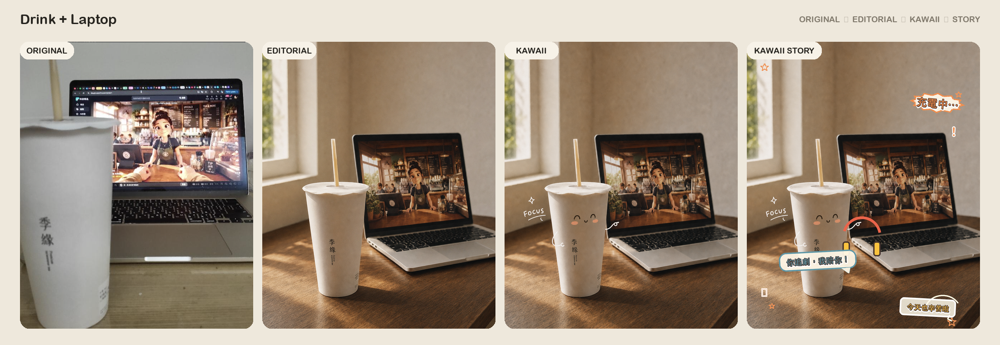
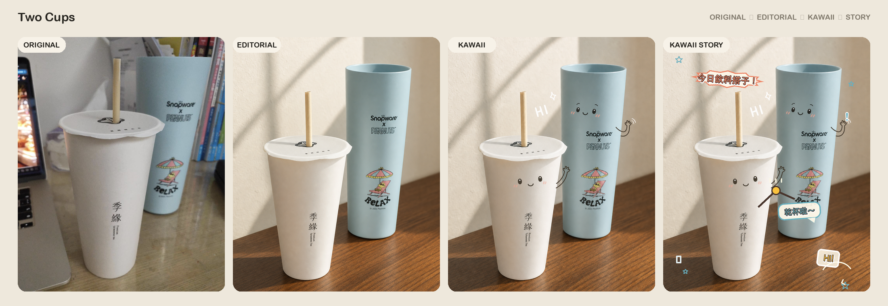
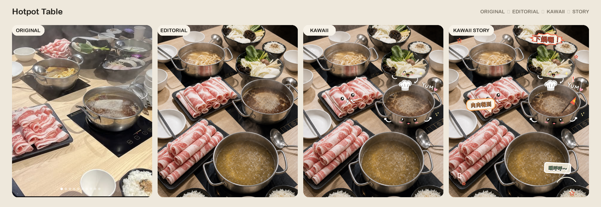
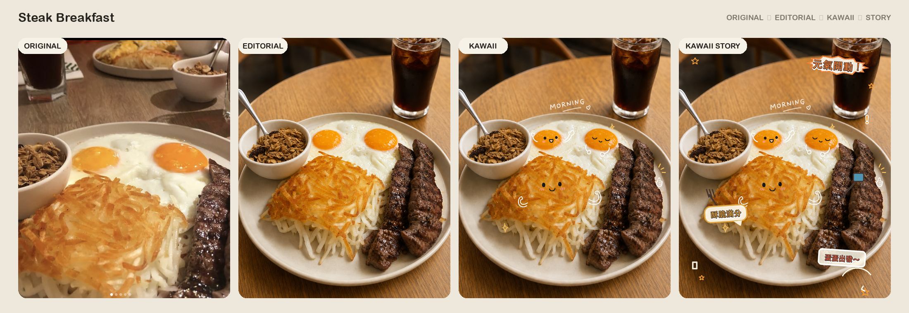
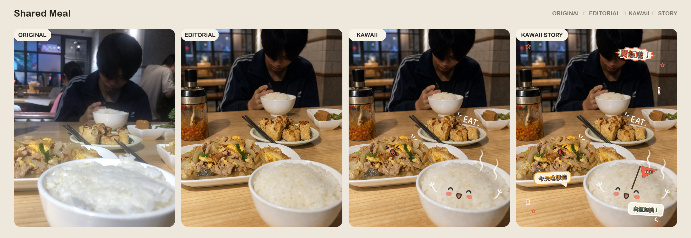
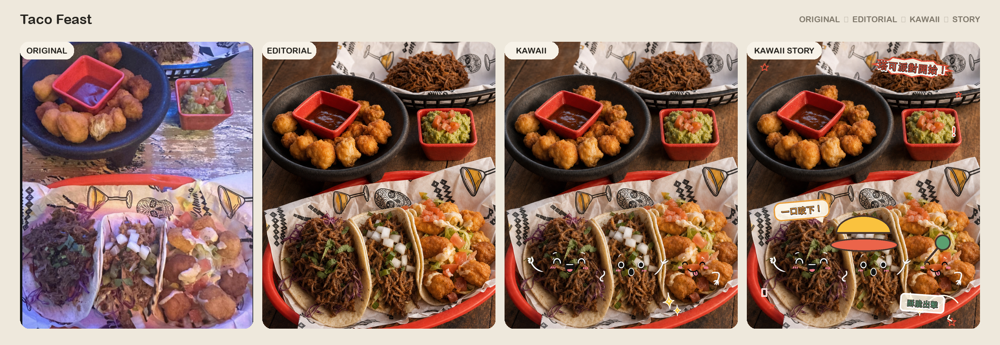
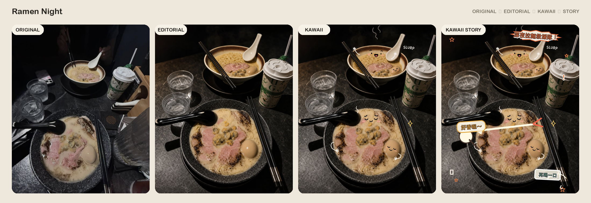
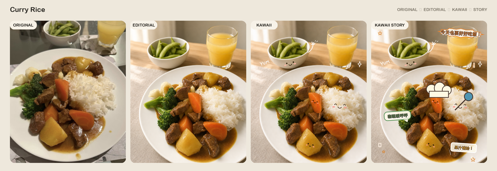
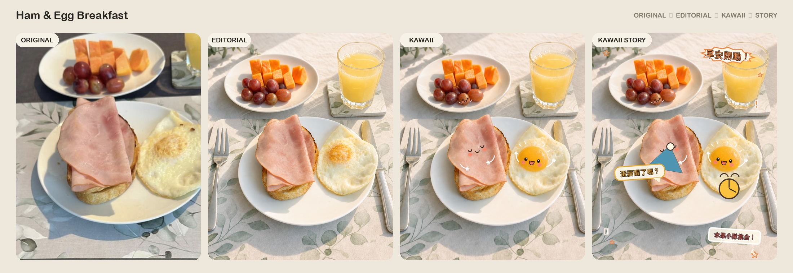

# Aesthetic Object Recomposer

Turn ordinary photos into polished Instagram-ready editorial images, then create matched clean-kawaii and captioned-story variants using the exact same composition.

[中文 README](README.md)

## Highlights

- Preserves object identity, count, materials, colors, labels, and recognizable details.
- Supports diagonal, triangle, S-curve, L-shape, table-corner, centered, rule-of-thirds, and negative-space compositions.
- Produces a matched three-image set by default:
  1. **Editorial:** clean lifestyle photography with natural window light and magazine styling.
  2. **Kawaii Clean:** an overlay-only Q-style character treatment based directly on the Editorial result.
  3. **Kawaii Story:** the clean character version plus lively speech-bubble lettering, dialogue, arrows, and small story-linked illustrated props.
- Locks crop, camera, placement, lighting, shadows, background, and depth of field across all three images.
- Uses deterministic post-production typesetting when exact Chinese text is required.
- Guards against fake text, floating objects, duplicate food, excessive orange grading, HDR, watermarks, and social-media UI.

## Installation

```bash
cp -R skill/aesthetic-object-recomposer ~/.codex/skills/
```

Alternatively, download and extract [`aesthetic-object-recomposer.zip`](aesthetic-object-recomposer.zip).

Restart Codex and invoke `$aesthetic-object-recomposer`.

## Example prompt

```text
Use $aesthetic-object-recomposer to rearrange the objects in this photo into an
editorial lifestyle composition, then create a matched kawaii doodle version.
```

## Workflow

1. Analyze the source and build a protected object inventory.
2. Lock identity-defining invariants.
3. Select recomposition strength and one dominant composition.
4. Generate the clean Editorial image first.
5. Use the approved Editorial image as the immutable base for Kawaii Clean.
6. Use the approved Kawaii Clean image as the immutable base for lively captions and a few story-supporting doodle props.
7. Validate object fidelity, grounding, shadows, depth, text accuracy, and set consistency.

## Comparisons

Each example shows **Original → Editorial → Kawaii Clean → Kawaii Story**.











## Notes

- Very small labels and trademarks may not be reproduced perfectly by image models.
- Kawaii lettering and illustrated props must not obscure food texture or product labels.
- People are not doodled by default.
- Example images are included only to demonstrate the transformation workflow.

## License

Skill documentation and code are released under the [MIT License](LICENSE). Example-image rights remain with their respective owners.
