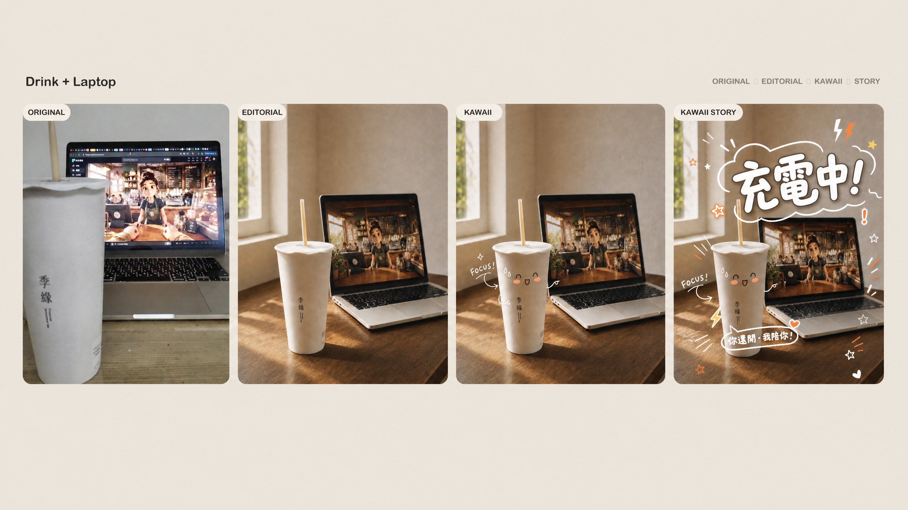
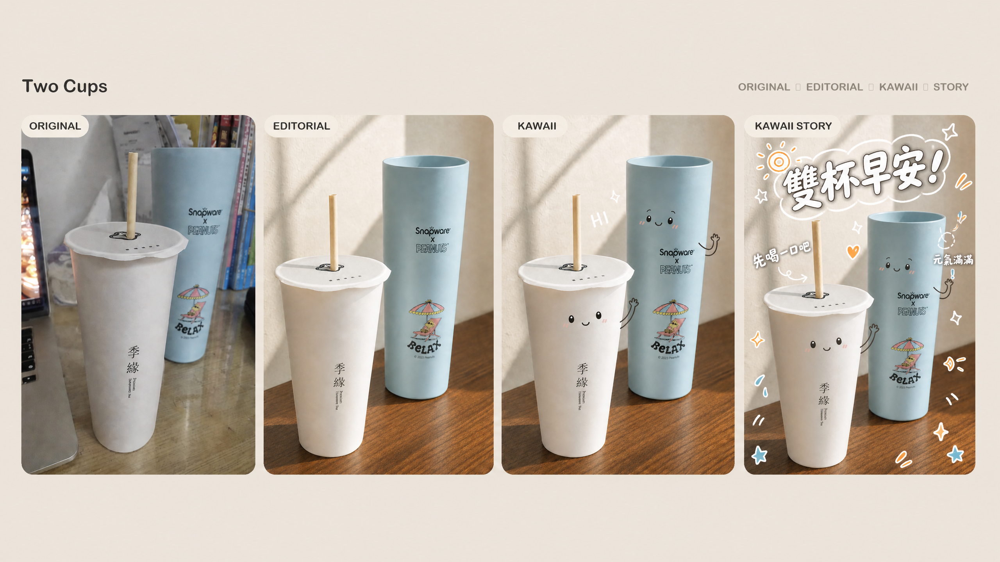

# Aesthetic Object Recomposer

Recompose ordinary object photos into social-ready editorial lifestyle imagery, then produce matched **Editorial**, **Kawaii Clean**, and **Kawaii Story** stages without composition drift. The current version defaults food, drinks, desktops, and shared meals to **Hero Story**, a bolder storytelling route built around immediate headline readability and playful character interaction.

[中文 README](README.md)

## Output modes

| Stage | Purpose | Visual rule |
| --- | --- | --- |
| **Editorial** | Arrange the source objects into calm, natural lifestyle photography. | Preserve object type, count, material, proportion, label, and identity-defining details. |
| **Kawaii Clean** | Add controlled kawaii characters over an immutable Editorial base. | Add only faces, short limbs, and sparse motion marks; do not alter the photograph. |
| **Kawaii Story — Hero Story** | Create an expressive social storytelling image for lively subjects. | Use one bold white handwritten headline, 1–2 short reactions, an organic white-outline cloud, and warm hand-drawn accent rhythm. |
| **Kawaii Story — Light Story** | Serve explicitly minimal, quiet, or premium requests. | Preserve the same photo and character layer, adding only low-density small annotations. |

## Hero Story v2 progression boards

Every current example presents **Original → Editorial → Kawaii → Kawaii Story**. The first three panels lock camera, crop, placement, lighting, shadows, and depth of field. The fourth panel uses Hero Story to strengthen readability, emotion, and social storytelling.

### Drink + Laptop



### Two Cups



### Hotpot Table


### Steak Breakfast


## Installation and use

Copy the skill directory to the Codex skills directory, restart Codex, and invoke `$aesthetic-object-recomposer`.

```bash
cp -R skill/aesthetic-object-recomposer ~/.codex/skills/
```

Provide a source image and specify the features that must be retained. The skill creates Editorial first, then Kawaii Clean from that approved image, then Kawaii Story from the approved Kawaii Clean image. Unless a user explicitly requests a minimal treatment, food, drinks, desktops, and shared meals use Hero Story.

## Hero Story direction

Place the primary headline in upper or otherwise calm negative space. Use bold, rounded white handwritten lettering with a thin dark keyline; when contrast requires it, use an organic transparent white-outline cloud that follows the words closely. Connect each short reaction to its character with a small arrow, tail, or motion mark. Cluster decorations asymmetrically and limit color to white plus one or two source-derived warm or dominant accents. Never cover product labels, food texture, faces, hands, or important highlights.

## File layout

```text
.
├── README.md
├── README.en.md
├── aesthetic-object-recomposer.zip
├── examples/
│   ├── drink-laptop-comparison-v2.png
│   ├── two-cups-comparison-v2.png
│   ├── hotpot-comparison-v2.png
│   └── breakfast-comparison-v2.png
└── skill/
    └── aesthetic-object-recomposer/
        ├── SKILL.md
        └── references/
            └── kawaii-story-hero.md
```

## Notes

Kawaii Story is an overlay pass over an approved Kawaii Clean image. It must not move, replace, repaint, or invent photographed objects. The accuracy of small labels and characters still depends on the selected image model; use controllable post-production typesetting when exact Chinese text is required.

## License

Skill documentation and code are released under the [MIT License](LICENSE). Example-image rights remain with their respective owners.
